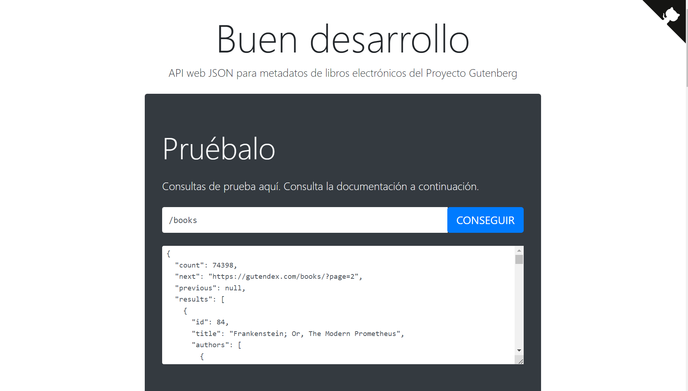
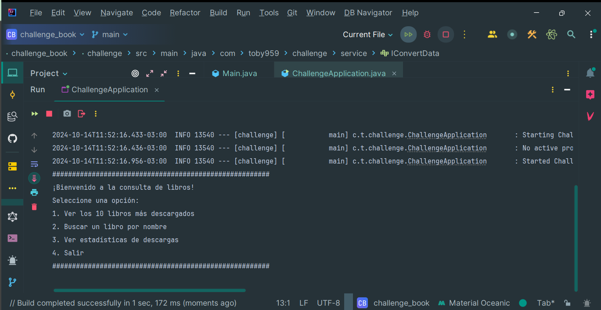
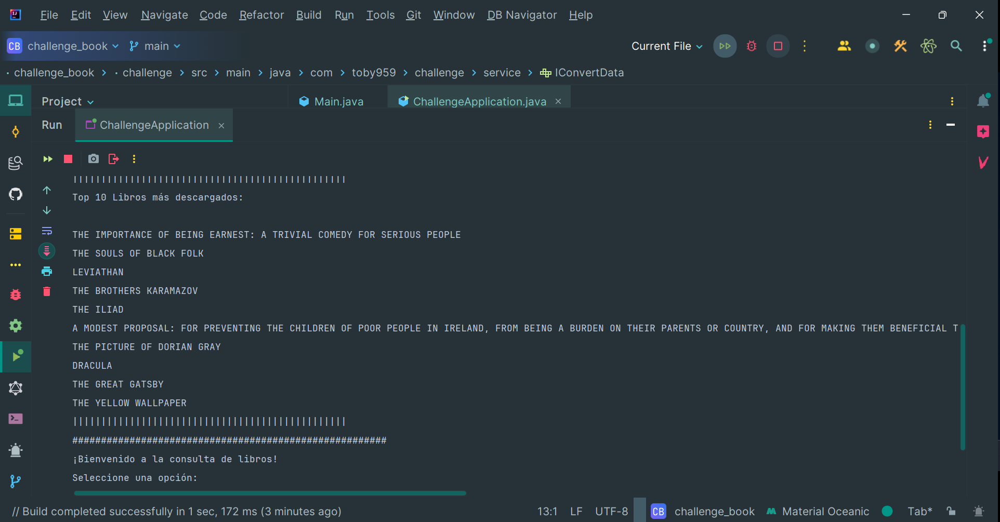
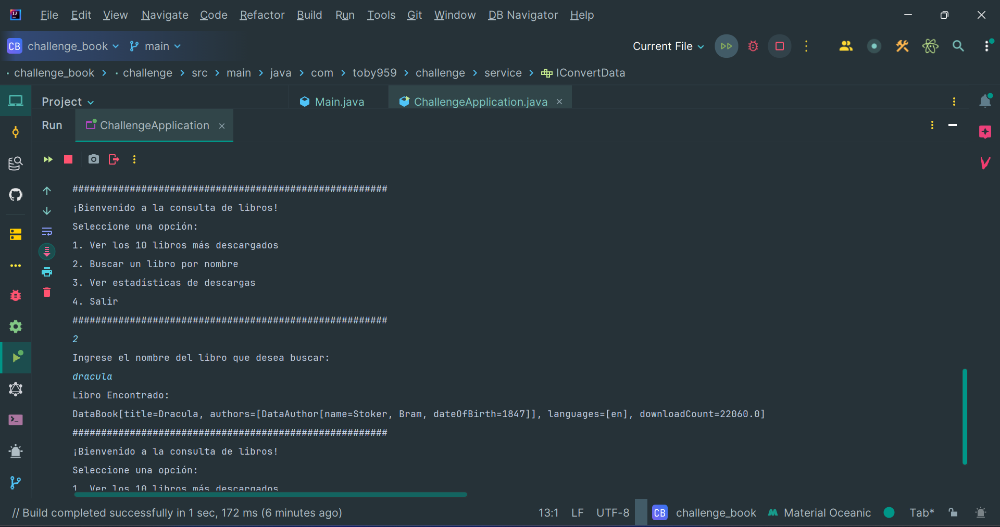
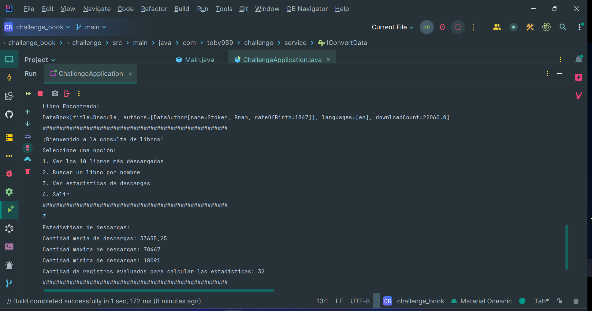
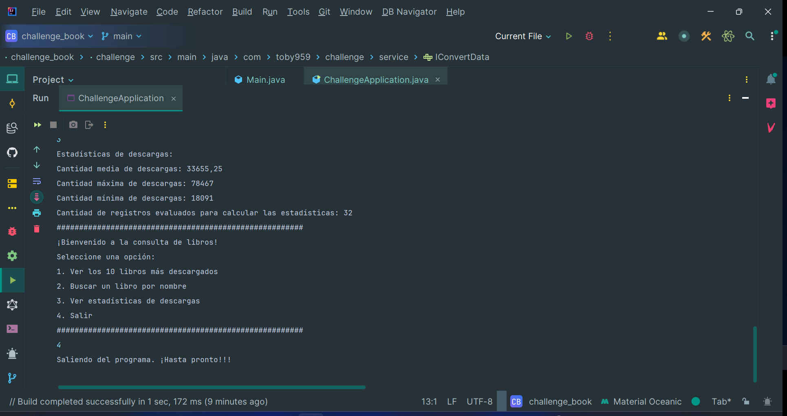

 <h1 aling="center"> Api Book's 📚 </h1>


&nbsp;&nbsp;&nbsp;&nbsp;&nbsp;&nbsp;&nbsp;&nbsp;&nbsp;[](LICENSE)&nbsp;&nbsp;&nbsp;

# Descripción 📖
Este proyecto es una API que permite acceder a una amplia base de datos de libros del Proyecto Gutenberg. No se requiere un token de acceso ni una clave API para realizar solicitudes a la API Gutendex, lo que facilita su integración en diversas aplicaciones.
Estas funcionalidades hacen que la API Gutendex sea una herramienta poderosa para acceder a una vasta colección de literatura clásica y facilitar su uso en diferentes contextos.

Puedes encontrar más información
sobre esta API en su [web](https://gutendex.com/?ref=public_apis)
___ 

# Recursos:

| Plugin            | URL                      |
|-------------------|--------------------------|
| jackson-databind  | https://mvnrepository.com/artifact/com.fasterxml.jackson.core/jackson-databind |
___
# Herramientas utilizadas 🛠️
* 1 - IntelliJ IDEA Community Edition: Un entorno de desarrollo integrado (IDE) para Java que facilita la programación.
* 2 - Java versión 17.0.10: La versión del lenguaje de programación Java utilizada en este proyecto.
* 3 - Scanner: Una herramienta fundamental en Java para la entrada de datos por consola, lo que permite interactuar con el usuario de manera efectiva.
* 4 - jackson-databind: es una herramienta fundamental para manipular y procesar JSON en Java.
* 5 - URLEncoder:  en Java es fundamental para codificar cadenas en un formato seguro para URLs.
___


# Ejecutar el Proyecto ⚙️
1 - Clona el repositorio en tu máquina local
``` bash
git clone
<https://github.com/toby959/challenge_book.git>
```
2 - Compila y ejecuta el archivo  ChallengeApplication.java.
___

# Funcionalidades 📦
#### La API de Gutendex.com es pública y de fácil acceso; se trata de un servicio web de tipo RESTful:
````bash
 gutendex.com/books
```` 
#### Parámetros de búsqueda: Permite filtrar libros por idioma, estado de copyright, año de autor, y realizar búsquedas textuales por título o autor.
#### Ordenamiento por popularidad: Los libros se pueden ordenar por popularidad, determinada por el número de descargas.
#### Formato de respuesta JSON: La API devuelve datos en formato JSON que incluyen detalles como el título, autores, idiomas y número de descargas.
#### Interfaz de Usuario: Ofrece una interfaz simple y amigable basada en la consola.
#### La API de Gutendex proporciona acceso a una vasta colección de libros del Proyecto Gutenberg. Actualmente, la API cuenta con más de 60,000 libros disponibles para consulta.



___
# Colaboraciones 🎯
Si deseas contribuir a este proyecto, por favor sigue estos pasos:

1 - Haz un fork del repositorio: Crea una copia del repositorio en tu cuenta de GitHub.  
2 - Crea una nueva rama: Utiliza el siguiente comando para crear y cambiar a una nueva rama:
```bash
git chechout -b feature-nueva
```
3 - Realiza tus cambios: Implementa las mejoras o funcionalidades que deseas agregar.  
4 - Haz un commit de tus cambios: Guarda tus cambios con un mensaje descriptivo:
```bash 
git commit -m 'Añadir nueva funcionalidad'
```
5 - Envía tus cambios: Sube tu rama al repositorio remoto:
````bash
git push origin feature-nueva
````
6 - Abre un pull request: Dirígete a la página del repositorio original y crea un pull request para que revisemos tus cambios.

Gracias por tu interés en contribuir a este proyecto. ¡Esperamos tus aportes!
___
# Imagenes:












## Licencia 📜

Este proyecto está licenciado bajo la Licencia MIT - ver el archivo [LICENSE](https://github.com/toby959/api_movies/blob/main/LICENSE) para más detalles.
